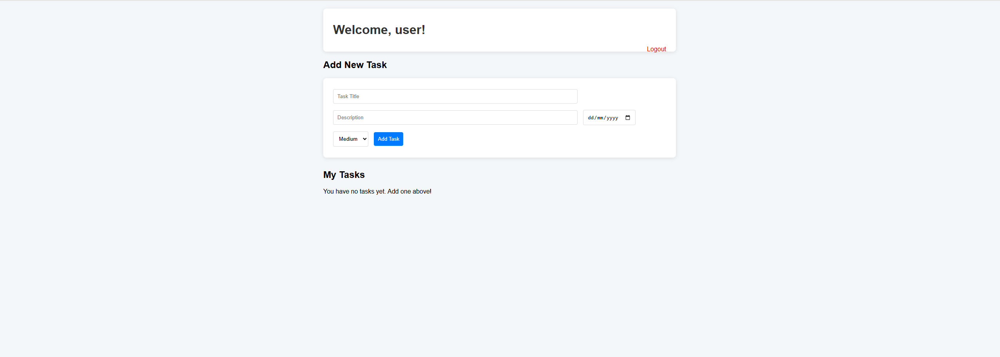

# Personal Task Manager

A clean and modern full-stack task management web application with user authentication.



## ✨ Features
- User registration and login
- Create, view and delete tasks
- Priority levels (Low / Medium / High)
- Modern responsive UI built with Tailwind CSS
- MongoDB Atlas cloud database

## 🛠 Tech Stack
- **Backend**: Node.js + Express.js
- **Frontend**: EJS + Tailwind CSS
- **Database**: MongoDB (MongoDB Atlas)
- **Authentication**: Express Session

## 📸 Screenshots


## How to Run Locally

```bash
git clone https://github.com/lkk7402/task-manager-app.git
cd task-manager-app
npm install
cp .env.example .env
npm run dev