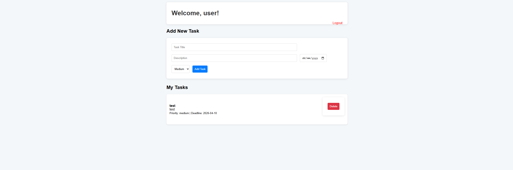

# Personal Task Manager

A full-stack task management web application with user authentication and CRUD operations.


## ✨ Features
- User registration and login with session management
- Create, view, and delete tasks
- Set task priority (Low / Medium / High) and deadline
- Clean and responsive user interface
- MongoDB Atlas cloud database

## 🛠 Tech Stack
- **Backend**: Node.js, Express.js
- **Database**: MongoDB (MongoDB Atlas)
- **Frontend**: EJS, CSS
- **Authentication**: Express Session
- **Others**: bcryptjs, dotenv, method-override

## 🚀 Live Demo
（如果你之後部署到 Render 再補上連結）

## 📸 Screenshots




## How to Run Locally

```bash
git clone https://github.com/lkk7402/task-manager-app.git
cd task-manager-app
npm install
cp .env.example .env
npm run dev